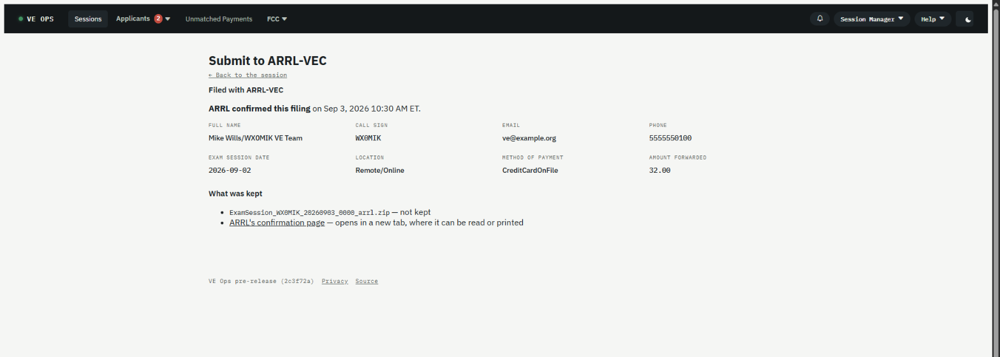
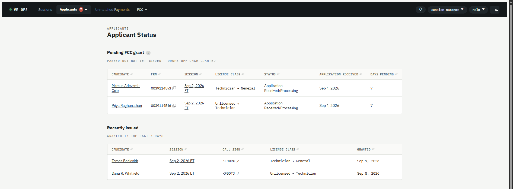

# Session Manager

You run sessions. The app's job is to make each one mostly happen on its own; your job is to watch
it, and to handle the handful of things a machine cannot decide.

Everything below is scoped to the teams you belong to. If you belong to more than one, the team
picker at the top of the page carries your choice across every screen.

## The short version of how the app works

Nothing in VE Ops is triggered by you clicking a button. Every automatic thing is a **scan**: a
background job wakes up, compares what it has against ExamTools and the FCC, and acts on the
difference. That has one consequence worth internalising —

**ExamTools is the source of truth for people.** Register a walk-in in ExamTools, move a candidate
between sessions in ExamTools, fix a spelling in ExamTools. VE Ops will pick it up on the next pass.
There is deliberately no in-app equivalent for those, because an ExamTools-side change would
overwrite it anyway.

## Before the session

Mostly you watch.

1. A session appears on the **Sessions** list within an hour of being created in ExamTools.
2. The Zoom meeting and Discord event are created for it automatically, if the team has those
   configured.
3. Each candidate who registers gets a payment link and a confirmation email automatically.
4. Reminders go out on the schedule the team's **Message Rules** define.

What you actually do:

- Check the session's detail page a day or two out. Registered count, everyone paid, the Zoom link
  present.
- **Invite VEs** to the session if your team uses invitations.
- Chase anyone the payment reminders have not moved.

## On the day

Two buttons matter, and a Team Lead can press both if you are not there:

- **Refresh candidates** — pulls ExamTools right now instead of waiting for the next pass. This is
  what you press when a walk-in was just registered in ExamTools: it ingests them, creates their
  payment link, and sends their confirmation email in one go.
- **Create retest payment** — for a candidate taking another element the same day.

## After the session

This is the part with real work in it.

1. **Results.** Exam results sync from ExamTools once the session is graded. You do not enter them.
2. **Submit to VEC.** File the session with the VEC from the session's page. ⚠️ **Never press
   submit twice after an `Unknown` result.** The VEC cannot de-duplicate and cannot unsend; a
   missing receipt is not proof that nothing was filed. The recovery procedure is
   [`arrl-filing-unconfirmed.md`](../runbooks/arrl-filing-unconfirmed.md).

   Once filed, the same page becomes the record of what was sent:

   
3. **Applicant Status.** Candidates now wait on the FCC. This screen is the list of everyone still
   waiting on a grant, across all your sessions. The app watches the FCC and moves them along on its
   own; the screen exists for when somebody asks.

   
4. **Unmatched Payments.** A payment that arrived without matching a candidate lands here for you to
   attach by hand. Usually somebody paid from a different email address.

## When something is wrong

Symptoms and their fixes are on one page: **[Something is wrong](Something-is-wrong.md)**. It covers
the payment that says unpaid, the email that never arrived, the filing that came back `Unknown`, and
the day nothing happens at all.

Anything that needs a credential changed, a message rule edited, or a job re-run is a **Team
Admin's** job, not yours. See [Team Admin](Guide-Team-Admin.md).

## The FCC's fee is not your fee

Two different fees, and confusing them is the most common misreading of this app:

- **Your team's exam fee** is collected through Square *before* the exam. No fee, no test — that is
  enforced by the VE at the door, not by the software. It can never legitimately be outstanding
  afterwards.
- **The FCC's own application fee** is paid by the candidate to the FCC through CORES, after they
  pass. That one *can* sit unpaid, and it expires the application after ten days. The reminders
  about an unpaid fee are always about this one.

## Related

- [Roles and permissions](Roles-and-Permissions.md) — exactly what you can open
- [Glossary](Glossary.md)
