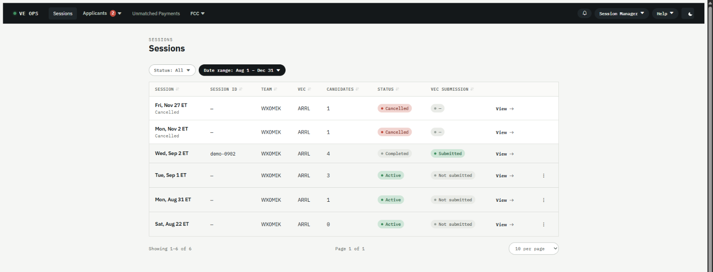
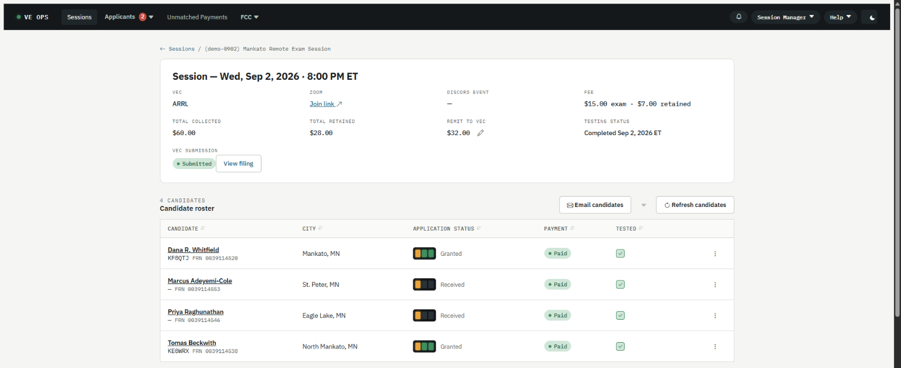

# Your first session

You've been given a Session Manager account and there's a session on the calendar. This page walks
one session from the day it appears to the day it's filed, so you know what the app does on its own
and what it needs from you.

Most of it happens without you. The parts that need you are marked **you do this**.

## Before you start

- An account with the **Session Manager** role, attached to your team. If the Sessions list is
  empty, you're probably not on a team yet — ask your Team Admin.
- The session already created in **ExamTools**. This app never creates sessions; it reads them.
- Your team's ExamTools credentials configured. If they aren't, nothing below happens at all, and
  that's a [Team Admin](Guide-Team-Admin.md) job.

## 1. The session appears

Within about an hour of the session being created in ExamTools, it shows up on your **Sessions**
list. You don't add it.

The same pass creates the Zoom meeting and the Discord event, if your team uses them.

## 2. Candidates register, and get what they need

Each candidate who registers in ExamTools is picked up on the next pass. Without you doing anything,
they get a confirmation email containing the session time in two time zones, the join link, and a
link to pay.

Reminders follow on whatever schedule your team's message rules define.

**You do this:** a day or two out, open the session and check three things — the registered count
looks right, the Zoom link is there, and nobody is still unpaid. Chasing an unpaid candidate is the
only work most sessions need.

## 3. On the day

Two buttons matter.

**Refresh candidates** pulls ExamTools immediately instead of waiting for the next pass. Press it
when someone has just been registered as a walk-in: it ingests them, creates their payment link, and
sends their confirmation email in one go.

**Create retest payment** covers a candidate sitting another element the same day.

A Team Lead can press both, so you don't have to be the one at the keyboard.

## 4. After the exam

Results sync from ExamTools once the session is graded. You don't enter them.

**You do this:** file the session with the VEC from the session's page.

> ⚠️ **Never press submit twice.** If the result comes back `Unknown`, the filing may still have
> landed — the VEC cannot de-duplicate and cannot unsend. Check with them first. The recovery steps
> are in [ARRL filing unconfirmed](../runbooks/arrl-filing-unconfirmed.md).

## 5. Confirm it worked

You're done when the session page shows:

- **VEC submission: Submitted**, with a **View filing** link beside it
- **Testing status: Completed**
- No candidate left with an unexplained **Unpaid** chip

Open **View filing** and you'll see what was sent, including the archive and ARRL's own confirmation
page. That's the record if anyone ever asks.

## What still needs watching

Passing the exam isn't the end for the candidate — the FCC has to grant the license, and the
candidate has to pay the FCC's own fee within ten days or the application expires.

**Applicant Status** is the list of everyone still waiting. The app watches the FCC and chases them
on its own; the screen exists for when somebody asks you where they are.

## Next steps

- [Session Manager](Guide-Session-Manager.md) — the same ground in more depth, plus the things that
  only come up occasionally
- [Something is wrong](Something-is-wrong.md) — when one of the steps above doesn't happen
- [Roles and permissions](Roles-and-Permissions.md) — what you can do, and what needs a Team Admin
- [Glossary](Glossary.md) — VEC, CSCE, FRN, CORES, and the words this app made up
